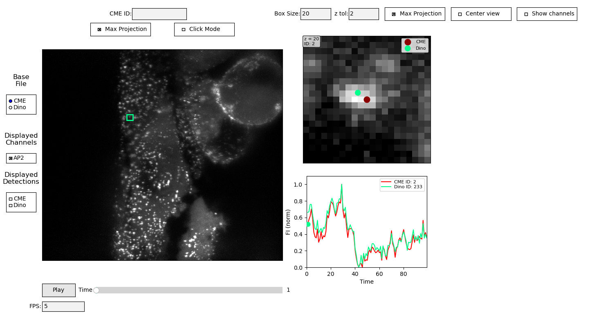
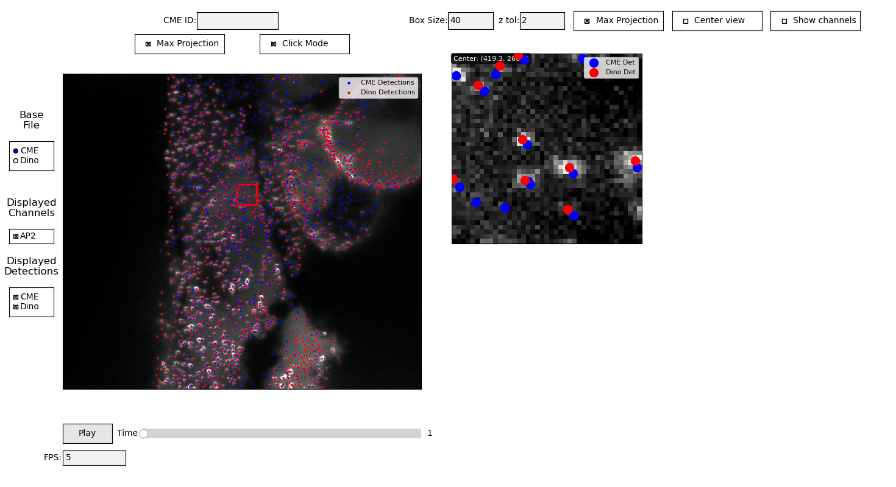
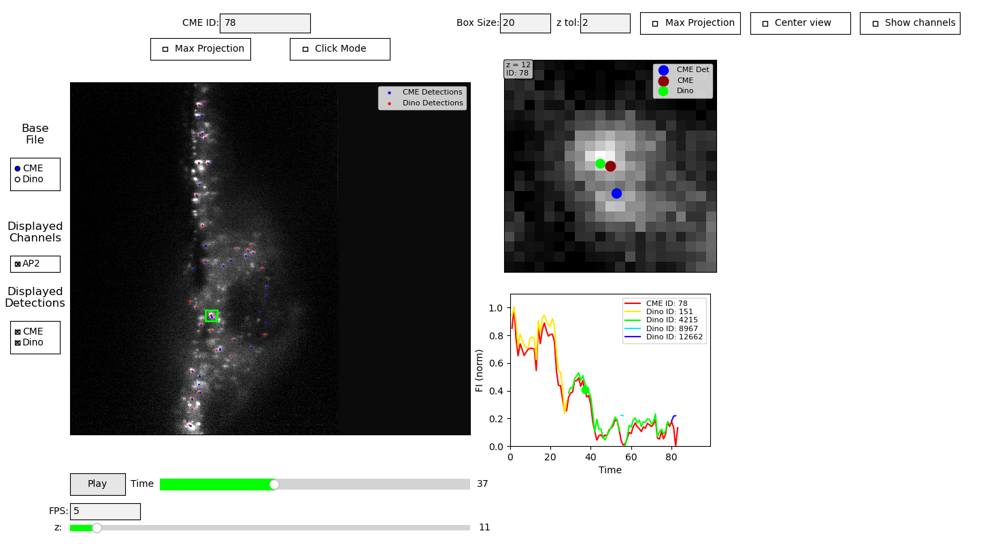
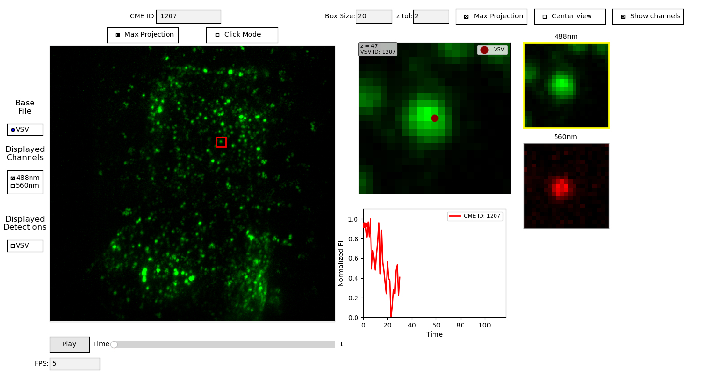
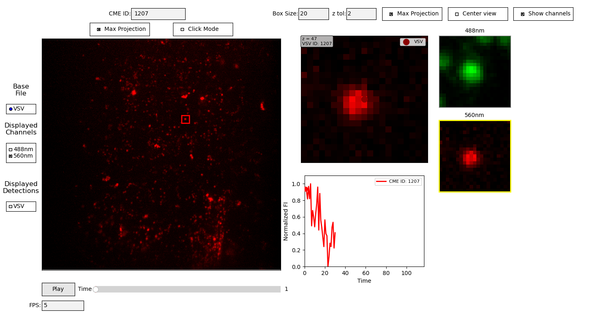
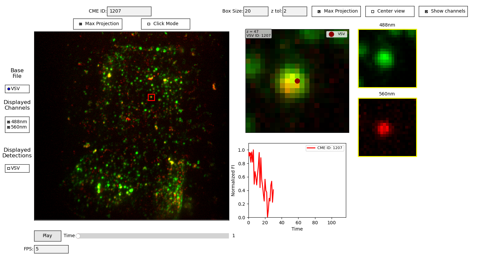
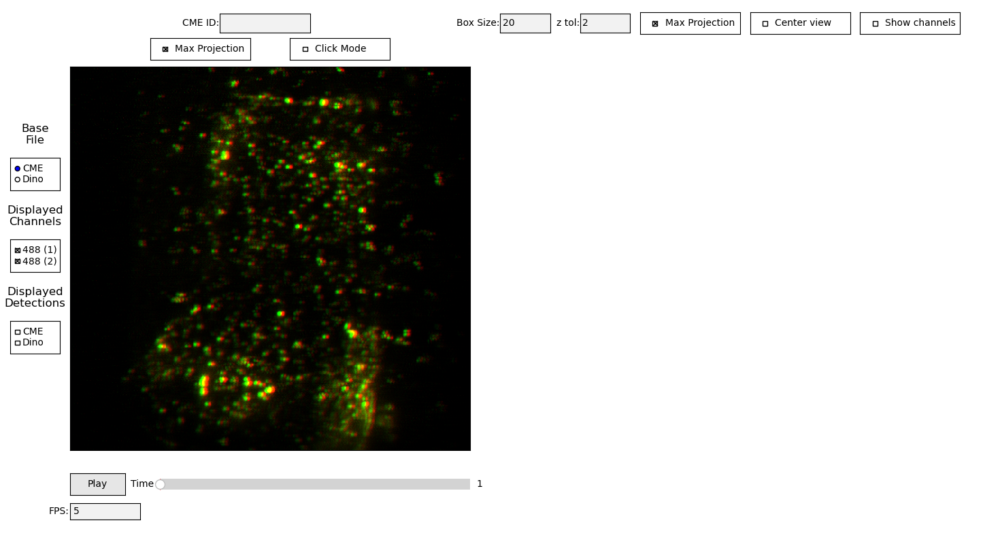
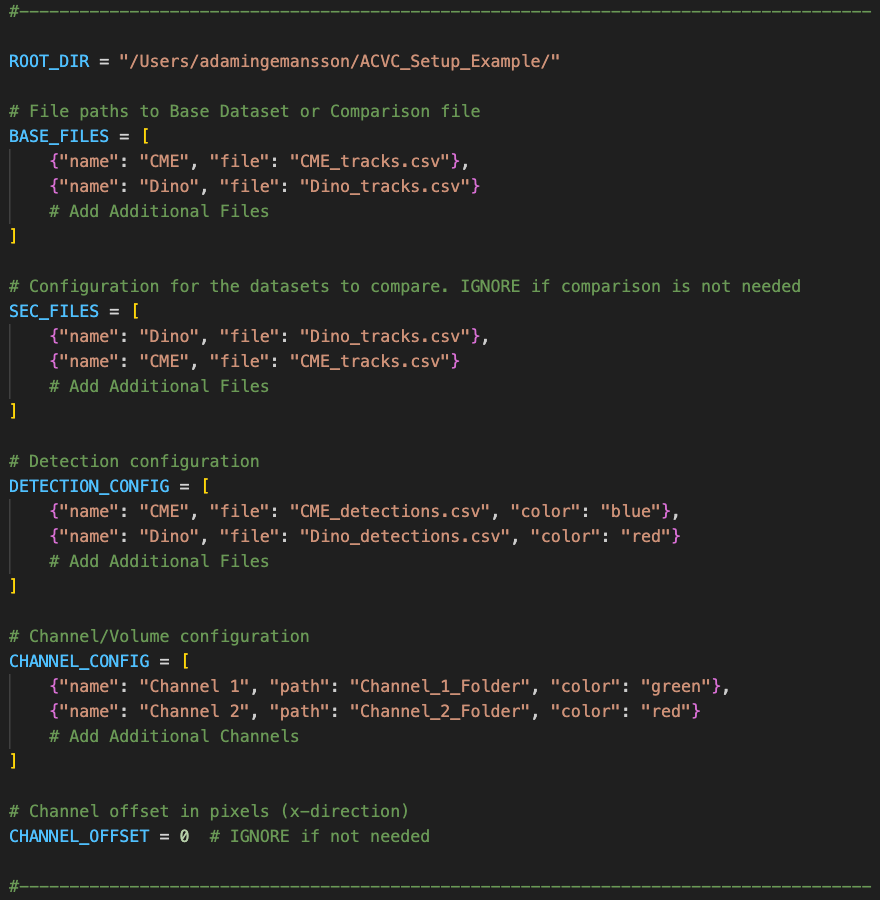

# AVCV — Interactive Imaging Viewer

## What This Tool Does
An interactive viewer for **multi‑channel time‑series microscopy data** (optionally with z‑stacks). It provides:

- **Synchronized channels** with unified processing: percentile normalization, background subtraction, pure additive RGB mapping, optional per‑channel x‑offset.
- **Tracking mode** to browse track IDs and plot normalized fluorescence intensity (FI) traces, with optional **comparison** and **coverage** overlays.
- **Detection mode** to visualize detection points from CSVs; **click to center** the view.
- **Fast inspection** with per‑channel patch views and dynamic channel toggles.
- **Keyboard + mouse navigation** for zoom, pan, frame and z navigation.

---

## Example Screenshots

**Maxprojection mode in comparison mode**  
  
*Shows the viewer in max‑projection mode, comparing two datasets across all z‑slices. Useful for quickly spotting co‑localization or differences over time.*

**Maxprojection mode in click mode with detections**  
  
*Demonstrates max‑projection combined with click‑to‑center functionality in detection mode. Detection points are overlaid, and clicking recenters the view on the selected object.*

**Without maxprojection — selected z‑slice**  
  
*Displays a single selected z‑plane instead of a projection. Helpful for examining structures at a specific focal depth.*

**Multiple channels — toggled on/off**  
  
  
  
*Same field of view with different channel combinations — single‑channel, alternate channel, and both channels fused. Demonstrates the effect of channel toggles.*

**With per‑channel offset**  
  
*Example with a horizontal offset applied to align features between channels. Useful for correcting small acquisition misalignments.*

---

## Example Videos

**1) Introduction / overview**  
<video src="videos/intro.mp4" controls width="720"></video>  
*[Download / open video](videos/intro.mp4)*

**2) Detections & swapping the Base dataset for tracking**  
<video src="videos/detections_and_base_swap.mp4" controls width="720"></video>  
*[Download / open video](videos/detections_and_base_swap.mp4)*

**3) Full time‑series for a single track**  
<video src="videos/track_full_time.mp4" controls width="720"></video>  
*[Download / open video](videos/track_full_time.mp4)*

---

## Repository Layout

```
.
├─ scripts/
│  ├─ AVCV.py           # main viewer (runnable)
│  └─ Comparison.py     # comparison/coverage helpers
├─ AVCV_example_set_up/ # example scripts + (your) example CSVs go here
│  ├─ AVCV.py
│  └─ Comparison.py
├─ images/              # (optional) example screenshots used in README
├─ videos/              # (optional) example videos used in README
├─ requirements.txt
├─ .gitignore
└─ README.md
```

---

## 1) Requirements

- **Python** 3.9+
- Python packages:
  - `numpy`
  - `pandas`
  - `matplotlib`
  - `tifffile`
  - `imagecodecs`

**Install (recommended in a virtual environment):**
```bash
python -m venv .venv && source .venv/bin/activate
pip install -r requirements.txt
```

---

## 2) Prepare Your `work/` Folder (Images + CSVs)

Create a `work/` folder (name is up to you; below we call it `work/`) with **one subfolder per imaging channel**. Each numbered subfolder generally holds one TIFF (either a 2D image or a multi‑page stack) for that timepoint.

```
work/
├─ Channel_1/
│  ├─ 001/img_001.tif
│  ├─ 002/img_002.tif
│  └─ ...
├─ Channel_2/		      # optional: secondary channel
│  ├─ 001/img_001.tif
│  └─ 002/img_002.tif
├─ CME_tracks.csv             # optional: tracking table
├─ Dino_tracks.csv            # optional: another tracking table
├─ detections_CME.csv         # optional: detection points
└─ detections_Dino.csv        # optional: detection points
```

**Notes**
- If a channel folder contains **flat `.tif` files directly** (no `001/`, `002/`…), the viewer will **auto‑create** numbered subfolders and move images there. If needed, it will also generate a per‑timepoint **`_maxproj.tif`** for multi‑page TIFFs (z‑stack max projection).
- Supports **2D** and **multi‑page TIFFs**. Non‑TIFF formats (png/jpg) are converted to TIFF on the fly to keep processing consistent.

---

## 3) Configure `AVCV.py` (Quick Edits)

Before running, open `AVCV.py` in your editor and set the configuration to point at your data.

**The screenshot below shows exactly where to edit:**  


### Variables you MUST edit

1. **`ROOT_DIR`**  
   Path to your data folder (usually where your `work/` and CSVs live). Absolute or relative paths both work.  
   Example:  
   ```python
   ROOT_DIR = "/Users/yourname/AVCV_example_set_up/"
   ```

2. **`BASE_FILES`** — Tracking: Base dataset  
   List of CSVs used as *Base* in tracking comparisons (visible in the GUI).

3. **`SEC_FILES`** — Tracking: Secondary dataset (optional)  
   List of CSVs to compare against the Base dataset.

4. **`DETECTION_CONFIG`** — Detection overlays  
   List of detection CSVs with a display color for each source.

5. **`CHANNEL_CONFIG`** — Imaging channels  
   One entry per channel with `"name"`, `"path"` (subfolder under `ROOT_DIR`), and `"color"` for RGB fusion.

6. **`CHANNEL_OFFSET`** (optional)  
   Integer pixel shift (x‑direction) to align channels horizontally.

**Configuration blocks in the file (unchanged format):**

**Tracking tables (Base/Secondary):**
```python
BASE_FILES = [
    {"name": "CME", "file": "CME_tracks.csv"},
    {"name": "Dino", "file": "Dino_tracks.csv"},
]
SEC_FILES = [
    {"name": "Dino", "file": "Dino_tracks.csv"},
    {"name": "CME", "file": "CME_tracks.csv"},
]
```

**Detection overlays:**
```python
DETECTION_CONFIG = [
    {"name": "CME",  "file": "detections_CME.csv",  "color": "blue"},
    {"name": "Dino", "file": "detections_Dino.csv", "color": "red"},
]
```

**Channel configuration and optional offset:**
```python
CHANNEL_CONFIG = [
    {"name": "Ch1", "path": r"work/Channel_1", "color": "red"},
    {"name": "Ch2", "path": r"work/Channel_2", "color": "green"},
]
CHANNEL_OFFSET = 0  # horizontal pixel shift applied to all channels (for alignment)
```

---

## 4) CSV Formats

### Tracking CSVs
Expected columns (headers required):
1. `ID`
2. `t0`  (track starting time point)
3. `t`   (frame/time index)
4. `x`
5. `y`
6. `z`
7. `FI`  (Fluorescence Intensity)
8. `TL`  (Track Length)

**Matching for comparison:** base vs secondary are matched by **same `t`** and **nearest 3D neighbor** (x, y, z) within a distance threshold.

### Detection CSVs
A simple list of detection points per frame. Typical columns:
```
t, x, y, z
```
(Minimum fields shown; extra columns are safely ignored. In a pinch, tracking CSVs can be reused as detection CSVs.)

---

## 5) Running the Viewer

From the folder containing `AVCV.py`:
```bash
python AVCV.py
```

A Matplotlib window opens with:
- The main fused view (RGB additive mapping of your channels).
- UI controls (sliders, checkboxes, radio buttons, text boxes) for:
  - Channel on/off toggles
  - Frame and z navigation
  - Tracking/Detection mode selection
  - Base/Secondary dataset selection
  - Threshold settings for comparison/coverage
  - ID / zoom / view options

> If your channel folders don’t exist or are empty, you’ll see warnings in the console. Fix the paths in `CHANNEL_CONFIG` or populate the folders and run again.

---

## 6) Controls

**Mouse**
- **Scroll**: zoom in/out
- **Drag** (left mouse): pan
- **Click** on a detection point: center the view

**Keyboard**
- **W/A/S/D**: pan up/left/down/right
- Frame/z navigation via on‑screen controls (and keybindings where available)
- Standard Matplotlib shortcuts (e.g., `Ctrl+S` to save a figure)

---

## 7) Tracking Mode Workflow

1. Select **Tracking mode**.
2. Choose a **Base** table (e.g., `CME_tracks.csv`) and optionally a **Secondary** table (e.g., `Dino_tracks.csv`) for comparison.
3. Enter an **ID** (or use next/previous controls) to browse tracked objects.
4. The viewer plots the **normalized FI trace** for the selected ID and overlays:
   - **Comparison**: nearest neighbor at the same `t` from the secondary table (within a distance threshold).
   - **Coverage**: timepoint‑level coverage derived from comparison.

If the comparison/coverage CSVs don’t exist yet, they are created on the fly (using `Comparison.py`) and saved to your `work/` folder with names like:
```
Comparison_{Base}_vs_{Secondary}.csv
ID_Coverage_{Base}_vs_{Secondary}.csv
```

---

## 8) Detection Mode Workflow

1. Select **Detection mode**.
2. Toggle one or more **detection sources** (e.g., “CME”, “Dino”) to overlay their points.
3. **Click** a point to center it; use frame/z controls to step through time or planes.

---

## 9) Tips & Troubleshooting

- **Channel paths not found** — Check `CHANNEL_CONFIG` paths. Use absolute paths or make them relative to your run directory.
- **No numbered subfolders** — The app will **auto‑organize** flat `.tif` files into `001/`, `002/`, … and create `_maxproj.tif` if needed.
- **Comparison empty** — Ensure Base and Secondary cover the **same time range** and increase the **distance threshold** slightly if matching is too strict.
- **Colors** — Accepts standard Matplotlib color names (`red`, `green`, `blue`, `magenta`, `cyan`, `yellow`, `orange`, `white`).
- **Performance** — Large stacks are heavy. Start with fewer channels, or pre‑generate max projections.

---

## 10) Minimal Checklist

- [ ] Python & packages installed (`numpy`, `pandas`, `matplotlib`, `tifffile`, `imagecodecs`)
- [ ] `work/` with per‑channel folders and `001/`, `002/`, … subfolders (or flat TIFFs that the app can reorganize)
- [ ] `CHANNEL_CONFIG` updated in `AVCV.py` (paths + colors)
- [ ] Optional CSVs placed in `work/`: `*_tracks.csv`, `detections_*.csv`
- [ ] Run `python AVCV.py`

---

## Support

**Issues:** Use GitHub Issues.  
**Contact:** Adam Ingemansson (adam.ingemansson@gmail.com)

## Citation

```
@article{AVCV,
  title={Adam's Very Cool Viewer: Automated Detection of Cellular Interactions using Self-Supervised Deep Learning},
  author={Adam Ingemansson},
  journal={[Journal]},
  year={2025}
}
```